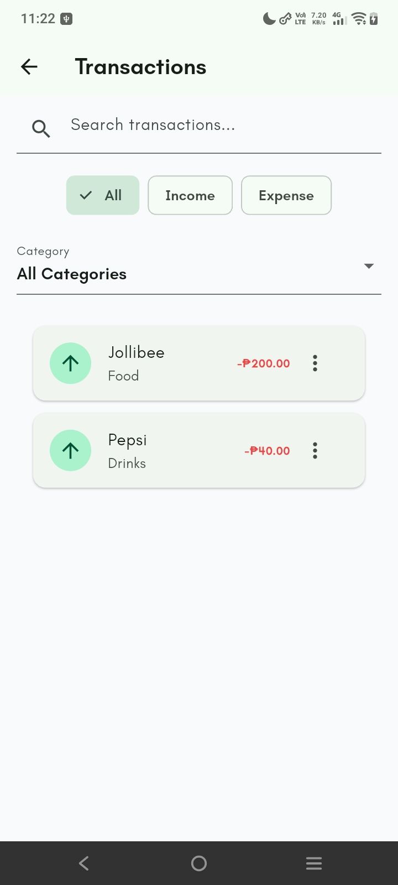
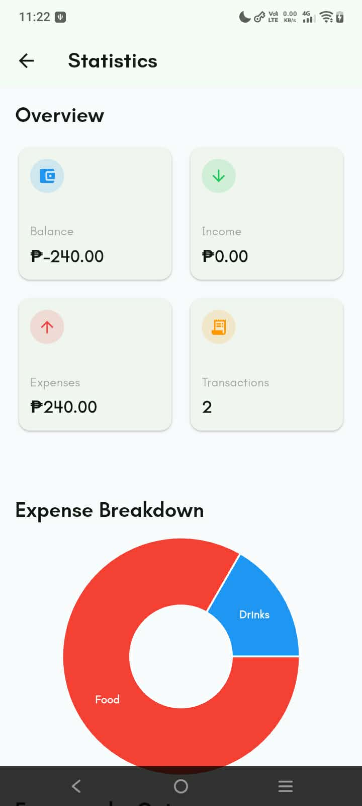

# 💰 ExpenseIQ

**Track. Manage. Understand.**

ExpenseIQ is a Flutter personal finance management application that helps users monitor their income, expenses, budgets, and financial insights. The app allows users to organize transactions, manage categories, analyze spending habits, and maintain their financial records with a clean and modern interface.

The project demonstrates clean Flutter architecture using the **Provider state management pattern**, **Repository Pattern**, **Dependency Injection**, and **Supabase backend integration**.

---

## 📱 Features

### 💰 Financial Management

- 💵 Track income and expense transactions
- ➕ Add new financial transactions
- ✏️ Edit existing transactions
- 🗑️ Delete transactions
- 💰 View total income, expenses, and remaining budget
- 📈 Monitor monthly budget progress

### 🔎 Organization

- 🔍 Search transactions by title
- 🏷️ Filter transactions by category and type
- 📂 Create and manage transaction categories

### 📊 Insights

- 📊 View financial statistics and expense breakdowns

### 👤 Profile

- 👤 Manage user profile information
- 🖼️ Upload and update profile images

### 🔐 Authentication

- 🔐 User authentication with Supabase

### 🎨 User Experience

- 🌙 Light and dark theme support
- 🧭 Smooth navigation using GoRouter
- ⚡ Loading, empty, and error state handling
- 🎨 Clean and responsive Material UI design

---

## 🛠️ Tech Stack

- **Flutter**
- **Dart**
- **Provider** (State Management)
- **Repository Pattern**
- **Dependency Injection**
- **Supabase**
  - Authentication
  - PostgreSQL Database
  - Storage
- **GoRouter**
- **FL Chart**
- **Image Picker**

---

## 🏗️ Architecture

ExpenseIQ follows a feature-based Clean Architecture approach.

```text
                         UI
                          │
                          ▼
                  Provider Layer
                          │
              ┌───────────┴───────────┐
              ▼                       ▼
       Repository Layer        Business Logic
              │
              ▼
        Supabase Backend
              │
      ┌───────┼────────┐
      ▼       ▼        ▼
 Database   Auth    Storage
```

Each layer has a single responsibility:

- **UI Layer** – Displays screens, widgets, and handles user interactions.
- **Provider Layer** – Manages application state, validation, and business logic.
- **Repository Layer** – Provides an abstraction between the application and external services.
- **Supabase Layer** – Handles authentication, database operations, and file storage.

---

## 📂 Project Structure

```text
lib/
│
├── core/
│   ├── constants/
│   ├── enums/
│   ├── router/
│   └── theme/
│
├── features/
│   │
│   ├── authentication/
│   │   ├── data/
│   │   ├── domain/
│   │   └── presentation/
│   │
│   ├── transactions/
│   │   ├── data/
│   │   ├── domain/
│   │   └── presentation/
│   │
│   ├── category/
│   │   ├── data/
│   │   ├── domain/
│   │   └── presentation/
│   │
│   ├── profile/
│   │   ├── data/
│   │   ├── domain/
│   │   └── presentation/
│   │
│   └── statistics/
│       └── presentation/
│
├── shared/
│   └── extensions/
│
└── main.dart
```

---

## 🗄️ Database

ExpenseIQ uses **Supabase PostgreSQL** as its backend database.

### Profiles

Stores user profile information.

```text
profiles
│
├── id
├── name
├── email
├── monthly_budget
├── profile_image
├── created_at
└── updated_at
```

### Transactions

Stores all financial records.

```text
transactions
│
├── id
├── user_id
├── title
├── amount
├── category_id
├── type
├── date
├── note
└── created_at
```

### Categories

Stores transaction categories.

```text
categories
│
├── id
├── user_id
├── name
├── type
├── icon
└── created_at
```

---

## 🚀 Getting Started

### 1. Clone the repository

```bash
git clone https://github.com/your-username/expenseiq.git
```

### 2. Navigate to the project

```bash
cd expenseiq
```

### 3. Install dependencies

```bash
flutter pub get
```

### 4. Configure Supabase

Create a Supabase project and configure the required credentials.

Update:

```text
lib/core/constants/supabase_config.dart
```

Example:

```dart
class SupabaseConfig {
  static const url = "YOUR_SUPABASE_URL";
  static const publishableKey = "YOUR_SUPABASE_KEY";
}
```

⚠️ Do not commit private credentials or secret keys to the repository

### 5. Run the application

```bash
flutter run
```

---

## 📸 Screenshots

| Dashboard | Transactions |
|-----------|--------------|
|  |  |

| Statistics | Profile |
|------------|---------|
|  |  |

---

## 🎯 Learning Objectives

This project demonstrates:

- Flutter application architecture
- Clean Architecture principles
- Provider state management
- Repository Pattern implementation
- Dependency Injection
- Supabase integration
- Authentication handling
- Database CRUD operations
- File upload and storage handling
- Data visualization with charts
- Navigation using GoRouter
- Form validation
- Error and loading state management
- Responsive Material UI design

---

## 🔮 Future Improvements

Possible future features:

- 📄 Export financial reports
- 🤖 AI-powered spending insights
- 🔔 Budget notifications
- 🔁 Recurring transactions
- 🎯 Savings goals tracking
- 📱 Mobile notifications
- 📊 Advanced analytics dashboard

---

## 🔐 Security

ExpenseIQ uses Supabase Authentication to manage user accounts and secure access to financial data.

### Security Practices

- Authentication is handled through Supabase Auth.
- User-specific data is associated with the authenticated user's ID.
- Supabase Row Level Security (RLS) should be enabled for database tables.
- Private credentials and secret keys should never be committed to the repository.
- The application should only use publishable Supabase credentials on the client.

---

## 📄 License

This project was created for educational and portfolio purposes.
